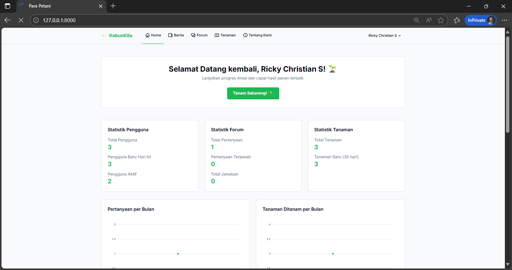
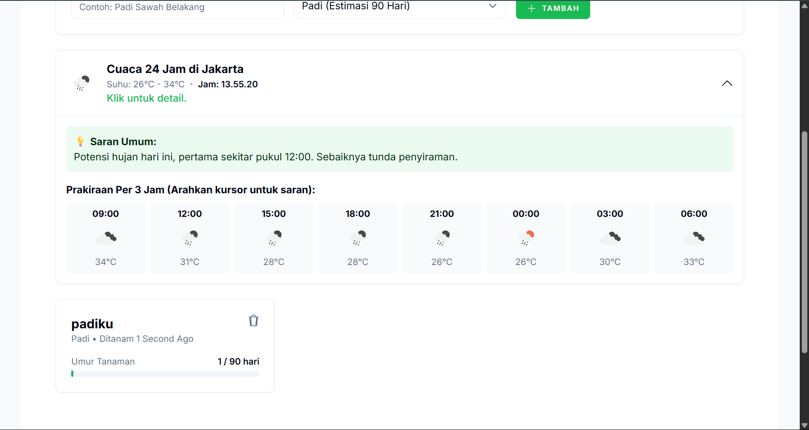

<p align="center">
  <a href="https://github.com/ricchrstn/KEBUNKITA" target="_blank">
    
  </a>
</p>

<h1 align="center">🌿 KebunKita</h1>

<p align="center">
  Aplikasi web komunitas dan manajemen tanaman berbasis Laravel & Tailwind CSS.
</p>

<p align="center">
  <a href="https://github.com/laravel/framework/actions"></a>
  <a href="#"></a>
  <a href="#"></a>
  <a href="#"></a>
</p>

---

## 📖 Deskripsi Proyek

**KebunKita** adalah aplikasi web berbasis Laravel yang berfungsi sebagai **Sistem Pemantauan Cuaca, Berita Pertanian, dan Manajemen Tanaman untuk Para Petani**, mendukung **tujuan Sustainable Development Goals (SDGs) ke-2: Zero Hunger**.

Aplikasi ini menyediakan fitur berita pertanian terkini, pemantauan tanaman pangan (padi & jagung), forum diskusi komunitas, serta saran pengolahan tanaman berdasarkan kondisi cuaca real-time.

---

## 🌐 Demo Langsung

- **URL:** [https://kebunkita.wuaze.com/](https://kebunkita.wuaze.com/)
- **Akun Demo:**
  - **Email:** `akuncoba@gmail.com`
  - **Password:** `akuncoba`

---

## 📸 Tampilan Aplikasi




<p align="center">
  <a href="https://regumawar.wuaze.com/" target="_blank">
    
  </a>
</p>

<h3 align="center">Sistem Pertanian Terpadu (Smart Farming System)</h3>

---

## 🚀 Fitur Utama

- 📰 **Berita Pertanian:** Menampilkan berita terkini melalui integrasi dengan **NewsAPI**.  
- 💬 **Forum Diskusi:** Fitur tanya-jawab komunitas dengan kemampuan memilih “jawaban terbaik”.  
- 🌱 **Manajemen Tanaman:** Menambah, menghapus, dan memantau data tanaman seperti padi dan jagung.  
- 🌦️ **Saran Berdasarkan Cuaca:** Rekomendasi perawatan tanaman berdasarkan data **OpenWeather API**.  
- 👤 **Manajemen Akun Pengguna:** Registrasi, login, pengeditan profil, dan penghapusan akun.  

---

## 🛠️ Teknologi yang Digunakan

| Kategori | Teknologi |
|-----------|------------|
| **Backend** | PHP 8.4.1, Laravel 12.21.0 |
| **Frontend** | Tailwind CSS 3.4 |
| **Database** | MySQL / MariaDB |
| **API Eksternal** | [NewsAPI](https://newsapi.org/) & [OpenWeather API](https://openweathermap.org/api) |

---

## ⚙️ Instalasi Lokal

### 1️⃣ Prasyarat
Pastikan sistem Anda telah terinstal:
- PHP ≥ 8.4  
- Composer 2.x  
- Node.js & npm  
- MySQL atau MariaDB  

### 2️⃣ Langkah Instalasi

Clone repositori dan masuk ke direktori proyek:
```bash
git clone https://github.com/ricchrstn/KEBUNKITA.git
cd KEBUNKITA

Instal dependensi backend dan frontend:

composer install
npm install


Salin file konfigurasi environment:

cp .env.example .env


Atur konfigurasi .env sesuai dengan database dan API key Anda:

DB_CONNECTION=mysql
DB_HOST=127.0.0.1
DB_PORT=3306
DB_DATABASE=nama_database_anda
DB_USERNAME=root
DB_PASSWORD=

# API Keys
NEWS_API_KEY=your_newsapi_key
OPENWEATHER_API_KEY=your_openweather_key


Generate application key:

php artisan key:generate


Migrasi database:

php artisan migrate


Compile aset frontend:

npm run dev
# Untuk versi produksi:
# npm run build


Jalankan server lokal:

php artisan serve

Akses aplikasi di: http://127.0.0.1:8000